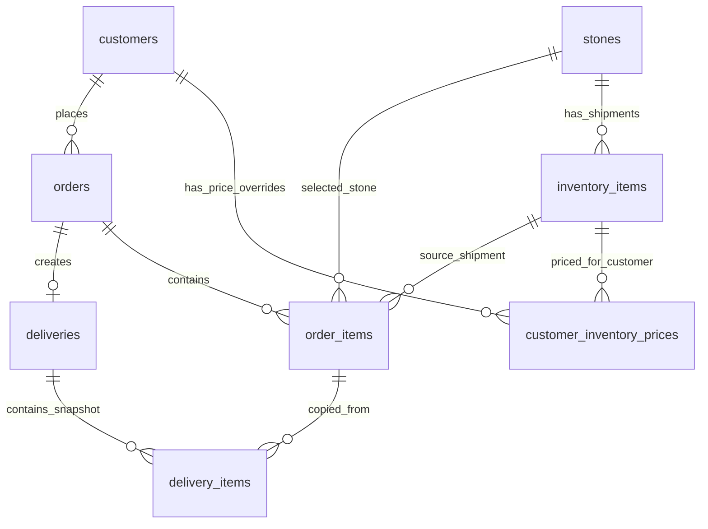

# תוכנית להפיכת Argaman CRM מדמו למערכת אמיתית

## הבנה עסקית ותפעולית

המערכת היא CRM פנימי לחברת ארגמן, שמוכרת אבן ושיש לקבלנים. המודל הנכון הוא לא "מוצר יחיד במלאי", אלא שלוש שכבות:

- `stones` הם הקטלוג: סוגי האבן שהחברה מוכרת. לכל אבן יש שם, סוג ליטוש, צבע, וסטטוס פעיל.
- `inventory_items` הם המשלוחים/אצוות המלאי שהגיעו ממחצבה או נמצאים בדרך. כל רשומת מלאי שייכת לאבן מהקטלוג ומכילה מידות, כמות, נפח מחושב, מחיר לקו"ב, מחיר ברירת מחדל ללקוח, סטטוס, ותאריך צפי הגעה אם היא בדרך.
- `orders` ו-`order_items` הם תעודות ההזמנה ופריטי הייצור. כל פריט הזמנה בוחר אבן מהקטלוג וגם את המשלוח הספציפי שממנו מזמינים. על הפריט עצמו מותר לשנות מידות ומחיר, כי כל לקוח מזמין במידות ובמחירים אחרים.

תעודת משלוח נוצרת רק מתוך תעודת הזמנה קיימת. היא מעתיקה את נתוני ההזמנה והפריטים למסמך משלוח, ומוסיפה פרטי תשלום, יעד תשלום, איסוף/שילוח, כתובת שילוח, תאריך מסירה, Green Invoice ID וסטטוס שולם/לא שולם.

רשימת חייבים אינה ישות עצמאית. היא view/שאילתה שמרכזת לקוחות שיש להם תעודות משלוח לא משולמות, עם ההזמנות הפתוחות לגבייה.

## מצב הפרויקט כרגע

- הפרויקט נמצא תחת `/Users/barzak/Desktop/Dev/Projects/argaman-crm/argaman-crm`.
- זה פרויקט Next.js App Router עם React 19, Next 16, Tailwind v4 ו-shadcn `radix-nova`.
- הפרויקט RTL (`components.json` כולל `"rtl": true`, ו-`app/layout.tsx` עם `dir="rtl"`).
- אין כרגע Supabase, אין auth, אין middleware ואין server actions.
- הדפים הבאים כבר מעוצבים חלקית וצריך לשמר את הקו העיצובי שלהם:
  - `/Users/barzak/Desktop/Dev/Projects/argaman-crm/argaman-crm/app/dashboard/page.tsx`
  - `/Users/barzak/Desktop/Dev/Projects/argaman-crm/argaman-crm/app/dashboard/customers/page.tsx`
  - `/Users/barzak/Desktop/Dev/Projects/argaman-crm/argaman-crm/app/dashboard/stones/page.tsx`
  - `/Users/barzak/Desktop/Dev/Projects/argaman-crm/argaman-crm/app/dashboard/stones/new/page.tsx`
  - `/Users/barzak/Desktop/Dev/Projects/argaman-crm/argaman-crm/app/dashboard/inventory/page.tsx`
  - `/Users/barzak/Desktop/Dev/Projects/argaman-crm/argaman-crm/app/dashboard/inventory/new/page.tsx`
- הדפים הבאים הם placeholders וצריך לבנות אותם:
  - `/Users/barzak/Desktop/Dev/Projects/argaman-crm/argaman-crm/app/dashboard/orders/page.tsx`
  - `/Users/barzak/Desktop/Dev/Projects/argaman-crm/argaman-crm/app/dashboard/order-items/page.tsx`
  - `/Users/barzak/Desktop/Dev/Projects/argaman-crm/argaman-crm/app/dashboard/deliveries/page.tsx`
  - `/Users/barzak/Desktop/Dev/Projects/argaman-crm/argaman-crm/app/dashboard/debtors/page.tsx`
- קבצי דמו שיימחקו בסוף, אחרי שכל import הוחלף:
  - `/Users/barzak/Desktop/Dev/Projects/argaman-crm/argaman-crm/app/dashboard/stones/stones-demo-data.ts`
  - `/Users/barzak/Desktop/Dev/Projects/argaman-crm/argaman-crm/app/dashboard/inventory/inventory-demo-data.ts`
  - `/Users/barzak/Desktop/Dev/Projects/argaman-crm/argaman-crm/app/dashboard/customers/customers-demo-data.ts`
- יש דמו נוסף בתוך `/Users/barzak/Desktop/Dev/Projects/argaman-crm/argaman-crm/components/sidebar/app-sidebar.tsx` בשם `stonePreview`; צריך להחליף אותו בנתונים אמיתיים או להסיר אותו.

## תרשים ישויות



## שלב 1: התקנות ותשתית Supabase

להוסיף dependencies:

```bash
pnpm add @supabase/supabase-js @supabase/ssr zod
```

להוסיף קבצים:

- `/Users/barzak/Desktop/Dev/Projects/argaman-crm/argaman-crm/lib/supabase/server.ts`
- `/Users/barzak/Desktop/Dev/Projects/argaman-crm/argaman-crm/lib/supabase/client.ts`
- `/Users/barzak/Desktop/Dev/Projects/argaman-crm/argaman-crm/lib/supabase/middleware.ts`
- `/Users/barzak/Desktop/Dev/Projects/argaman-crm/argaman-crm/middleware.ts`
- `/Users/barzak/Desktop/Dev/Projects/argaman-crm/argaman-crm/lib/db/types.ts`
- `/Users/barzak/Desktop/Dev/Projects/argaman-crm/argaman-crm/lib/db/format.ts`
- `/Users/barzak/Desktop/Dev/Projects/argaman-crm/argaman-crm/lib/db/calculations.ts`

משתני סביבה שהמשתמש יצטרך להגדיר ב-`.env.local`:

```bash
NEXT_PUBLIC_SUPABASE_URL=
NEXT_PUBLIC_SUPABASE_ANON_KEY=
```

אין הרשמה למערכת. יש רק sign in עם מייל וסיסמה למשתמש שכבר נוצר ב-Supabase Auth.

ה-auth צריך לעבוד כך:

- `/login` מציג טופס מייל וסיסמה.
- login מבצע `supabase.auth.signInWithPassword`.
- `/dashboard/*` מוגן. אם אין session, redirect ל-`/login`.
- אם יש session ונכנסים ל-`/login`, redirect ל-`/dashboard`.
- `middleware.ts` מרענן session לפי הדוגמה הרשמית של `@supabase/ssr`.
- `app/dashboard/layout.tsx` צריך להיות server component שבודק `getUser()` לפני עטיפת `AppShell`.
- `components/app-shell.tsx`, `PageHeader` ו-sidebar יכולים להישאר client components.

## שלב 2: קובץ SQL להרצה ב-Supabase

ליצור קובץ:

- `/Users/barzak/Desktop/Dev/Projects/argaman-crm/argaman-crm/supabase-schema.sql`

הקובץ צריך להיות self-contained ולכלול:

- extensions:
  - `pgcrypto` עבור `gen_random_uuid()`
- enum types:
  - `inventory_status`: `available`, `unavailable`, `in_transit`
  - `order_status`: `open`, `in_production`, `ready_for_delivery`, `completed`, `cancelled`
  - `order_item_status`: `pending`, `in_progress`, `completed`, `cancelled`
  - `priority`: `low`, `medium`, `urgent`
  - `fulfillment_method`: `pickup`, `shipping`
  - `delivery_status`: `waiting_for_pickup`, `in_transit`, `delivered`, `cancelled`
  - `payment_status`: `unpaid`, `paid`
  - `payment_method`: `cash`, `bank_transfer`, `check`, `credit_card`, `other`
- helper trigger `set_updated_at()`.
- RLS enabled on all tables.
- policies פשוטות למערכת פנימית:
  - authenticated users can select/insert/update/delete on all CRM tables.
  - no anonymous access.

טבלאות:

### `stones`

שדות:

- `id uuid primary key default gen_random_uuid()`
- `name text not null`
- `polish_type text not null`
- `color_hex text not null`
- `is_active boolean not null default true`
- `created_at timestamptz not null default now()`
- `updated_at timestamptz not null default now()`

Constraints:

- `color_hex` חייב להתאים ל-hex עם `check (color_hex ~ '^#[0-9A-Fa-f]{6}$')`.
- unique חלקי מומלץ על `(name, polish_type)` כשהאבן פעילה.

### `customers`

שדות:

- `id uuid primary key default gen_random_uuid()`
- `name text not null`
- `tax_id text not null`
- `email text`
- `phone text`
- `address text`
- `is_active boolean not null default true`
- `notes text`
- `created_at timestamptz not null default now()`
- `updated_at timestamptz not null default now()`

Constraints:

- `tax_id` unique.

### `inventory_items`

זו טבלת משלוחים/אצוות מלאי.

שדות:

- `id uuid primary key default gen_random_uuid()`
- `stone_id uuid not null references stones(id)`
- `length_m numeric(10,3) not null`
- `width_m numeric(10,3) not null`
- `height_m numeric(10,3) not null`
- `quantity_total integer not null`
- `quantity_reserved integer not null default 0`
- `quantity_delivered integer not null default 0`
- `volume_m3 numeric(12,4) generated always as (length_m * width_m * height_m * quantity_total) stored`
- `price_per_m3 numeric(12,2) not null`
- `customer_price numeric(12,2) not null`
- `status inventory_status not null default 'available'`
- `expected_arrival_date date`
- `created_at timestamptz not null default now()`
- `updated_at timestamptz not null default now()`

Constraints:

- all dimensions > 0.
- `quantity_total > 0`.
- `quantity_reserved >= 0`.
- `quantity_delivered >= 0`.
- `quantity_reserved + quantity_delivered <= quantity_total`.
- if `status = 'in_transit'`, `expected_arrival_date is not null`.
- if `status <> 'in_transit'`, `expected_arrival_date` may be null.

Calculated availability:

- `quantity_available = quantity_total - quantity_reserved - quantity_delivered`.
- בדפי UI לחשב זאת בשאילתה או ב-view.

### `customer_inventory_prices`

מחירים מיוחדים ללקוח עבור פריטי מלאי ספציפיים.

שדות:

- `id uuid primary key default gen_random_uuid()`
- `customer_id uuid not null references customers(id) on delete cascade`
- `inventory_item_id uuid not null references inventory_items(id) on delete cascade`
- `price_per_m3 numeric(12,2)`
- `customer_price numeric(12,2)`
- `created_at timestamptz not null default now()`
- `updated_at timestamptz not null default now()`

Constraints:

- unique `(customer_id, inventory_item_id)`.
- לפחות אחד מבין `price_per_m3`, `customer_price` אינו null.

### `orders`

שדות:

- `id uuid primary key default gen_random_uuid()`
- `order_number bigint generated by sequence` או sequence נפרד `order_number_seq`
- `customer_id uuid not null references customers(id)`
- `status order_status not null default 'open'`
- `priority priority not null default 'medium'`
- `supply_due_date date`
- `signature_url text`
- `vat_rate numeric(5,4) not null default 0.18`
- `subtotal numeric(12,2) not null default 0`
- `vat_amount numeric(12,2) not null default 0`
- `total numeric(12,2) not null default 0`
- `created_at timestamptz not null default now()`
- `updated_at timestamptz not null default now()`

Constraints:

- `vat_rate = 0.18` כברירת מחדל אבל לא לנעול אם בעתיד המע"מ משתנה.
- `signature_url` null או URL תקין בסיסית.

### `order_items`

שדות:

- `id uuid primary key default gen_random_uuid()`
- `order_id uuid not null references orders(id) on delete cascade`
- `stone_id uuid not null references stones(id)`
- `inventory_item_id uuid not null references inventory_items(id)`
- `length_m numeric(10,3) not null`
- `width_m numeric(10,3) not null`
- `height_m numeric(10,3) not null`
- `quantity integer not null`
- `volume_m3 numeric(12,4) generated always as (length_m * width_m * height_m * quantity) stored`
- `price_per_m3 numeric(12,2) not null`
- `line_subtotal numeric(12,2) generated always as ((length_m * width_m * height_m * quantity) * price_per_m3) stored`
- `status order_item_status not null default 'pending'`
- `created_at timestamptz not null default now()`
- `updated_at timestamptz not null default now()`

Constraints:

- all dimensions > 0.
- `quantity > 0`.

חשוב:

- ב-server action של יצירת/עדכון הזמנה יש לבצע transaction או RPC כדי:
  - לוודא שהמלאי שנבחר קיים וזמין.
  - לוודא שיש מספיק `quantity_available`.
  - לעדכן `quantity_reserved` בפריט המלאי.
  - לחשב מחדש totals בהזמנה.
- לא לסמוך רק על UI בשביל חישובי מלאי.

### `deliveries`

שדות:

- `id uuid primary key default gen_random_uuid()`
- `delivery_number bigint generated by sequence` או sequence נפרד `delivery_number_seq`
- `order_id uuid not null references orders(id)`
- `customer_id uuid not null references customers(id)`
- `status delivery_status not null default 'waiting_for_pickup'`
- `payment_status payment_status not null default 'unpaid'`
- `payment_method payment_method`
- `payment_due_date date`
- `fulfillment_method fulfillment_method not null default 'pickup'`
- `shipping_address text`
- `delivered_at date`
- `green_invoice_id text`
- `subtotal numeric(12,2) not null default 0`
- `vat_amount numeric(12,2) not null default 0`
- `total numeric(12,2) not null default 0`
- `created_at timestamptz not null default now()`
- `updated_at timestamptz not null default now()`

Constraints:

- unique `(order_id)` אם מחליטים שכל הזמנה יכולה להפיק תעודת משלוח אחת בלבד.
- if `fulfillment_method = 'shipping'`, `shipping_address is not null`.

### `delivery_items`

Snapshot של פריטי ההזמנה בזמן יצירת תעודת המשלוח.

שדות:

- `id uuid primary key default gen_random_uuid()`
- `delivery_id uuid not null references deliveries(id) on delete cascade`
- `order_item_id uuid not null references order_items(id)`
- `stone_id uuid not null references stones(id)`
- `inventory_item_id uuid not null references inventory_items(id)`
- `stone_name text not null`
- `polish_type text not null`
- `color_hex text not null`
- `length_m numeric(10,3) not null`
- `width_m numeric(10,3) not null`
- `height_m numeric(10,3) not null`
- `quantity integer not null`
- `volume_m3 numeric(12,4) not null`
- `price_per_m3 numeric(12,2) not null`
- `line_subtotal numeric(12,2) not null`
- `created_at timestamptz not null default now()`

ביצירת תעודת משלוח:

- להעתיק את פריטי ההזמנה ל-`delivery_items`.
- להעביר `quantity_reserved` ל-`quantity_delivered` במלאי.
- לעדכן `orders.status` ל-`completed` או להשאיר `ready_for_delivery` לפי החלטת UI. ברירת מחדל מומלצת: כשיוצרים תעודת משלוח, ההזמנה נשארת `ready_for_delivery`; כשתעודת המשלוח `delivered`, לעדכן הזמנה ל-`completed`.

### Views מומלצים

להוסיף views בקובץ SQL כדי לפשט את הדפים:

- `inventory_items_view`: מצטרף ל-`stones`, מוסיף `quantity_available`, `stone_name`, `polish_type`, `color_hex`.
- `orders_view`: מצטרף ל-`customers`, כולל כמות פריטים ו-total.
- `order_items_view`: מצטרף ל-`orders`, `customers`, `stones`, `inventory_items`.
- `deliveries_view`: מצטרף ל-`orders`, `customers`.
- `debtors_view`: כל תעודות המשלוח עם `payment_status = 'unpaid'`, מקובצות או זמינות לקיבוץ לפי לקוח באפליקציה.
- `dashboard_kpis_view`: שורה אחת עם מדדי הדאשבורד.

## שלב 3: שכבת DB, טיפוסים וחישובים

להוסיף `/Users/barzak/Desktop/Dev/Projects/argaman-crm/argaman-crm/lib/db/calculations.ts`:

- `computeVolumeM3({ lengthM, widthM, heightM, quantity })`.
- `computeLineSubtotal(volumeM3, pricePerM3)`.
- `computeVat(subtotal, vatRate = 0.18)`.
- `computeTotal(subtotal, vatRate = 0.18)`.
- formatters ל-ILS, מטרים, קו"ב.

להעביר לוגיקה קיימת מ-`inventory-demo-data.ts` לכאן לפני מחיקת קובץ הדמו.

להוסיף `/Users/barzak/Desktop/Dev/Projects/argaman-crm/argaman-crm/lib/db/types.ts`:

- טיפוסים ידניים או Supabase generated types אם מחליטים להפיק אותם בהמשך.
- טיפוסי UI שטוחים ל-views:
  - `Stone`
  - `InventoryItemView`
  - `Customer`
  - `OrderView`
  - `OrderItemView`
  - `DeliveryView`
  - `DebtorRow`

## שלב 4: Server Actions ו-CRUD

לכל אזור ליצור `actions.ts` ליד הדף הרלוונטי. כל actions צריכים:

- לרוץ בצד שרת בלבד.
- להשתמש ב-`createClient()` מתוך `lib/supabase/server.ts`.
- לוודא שיש user מחובר.
- לבצע validation עם `zod`.
- לקרוא `revalidatePath(...)`.
- להחזיר `{ ok: true }` או `{ ok: false, message }`.

קבצים:

- `/Users/barzak/Desktop/Dev/Projects/argaman-crm/argaman-crm/app/dashboard/stones/actions.ts`
  - `createStone`
  - `updateStone`
  - `deleteStone` או `archiveStone` מומלץ כ-soft delete דרך `is_active = false`
- `/Users/barzak/Desktop/Dev/Projects/argaman-crm/argaman-crm/app/dashboard/inventory/actions.ts`
  - `createInventoryItem`
  - `updateInventoryItem`
  - `deleteInventoryItem` רק אם אין הזמנות; אחרת `status = 'unavailable'`
- `/Users/barzak/Desktop/Dev/Projects/argaman-crm/argaman-crm/app/dashboard/customers/actions.ts`
  - `createCustomer`
  - `updateCustomer`
  - `deleteCustomer` או `archiveCustomer`
  - `upsertCustomerInventoryPrice`
  - `deleteCustomerInventoryPrice`
- `/Users/barzak/Desktop/Dev/Projects/argaman-crm/argaman-crm/app/dashboard/orders/actions.ts`
  - `createOrder`
  - `updateOrder`
  - `deleteOrder`
  - `updateOrderStatus`
  - `updateOrderItemStatus`
  - `recalculateOrderTotals`
- `/Users/barzak/Desktop/Dev/Projects/argaman-crm/argaman-crm/app/dashboard/deliveries/actions.ts`
  - `createDeliveryFromOrder`
  - `updateDelivery`
  - `markDeliveryPaid`
  - `updateDeliveryStatus`

פעולה קריטית: `createOrder`

- מקבלת `customerId`, `priority`, `supplyDueDate`, `signatureUrl`, ומערך items.
- כל item כולל `stoneId`, `inventoryItemId`, מידות, כמות, `pricePerM3`.
- אם ללקוח יש `customer_inventory_prices` עבור `inventoryItemId`, UI ימלא את המחיר כברירת מחדל, אבל ה-server עדיין צריך לקבל מחיר מפורש ולשמור אותו.
- צריך לוודא ש-`inventoryItem.stone_id === stoneId`.
- צריך לוודא שיש מספיק זמינות: `quantity_total - quantity_reserved - quantity_delivered >= quantity`.
- צריך להגדיל `quantity_reserved`.
- צריך ליצור order + order_items.
- צריך לחשב `subtotal`, `vat_amount`, `total`.

פעולה קריטית: `deleteOrder`

- מותר למחוק רק אם אין delivery.
- צריך לשחרר reservations: להפחית את הכמויות של `order_items.quantity` מתוך `inventory_items.quantity_reserved`.

פעולה קריטית: `createDeliveryFromOrder`

- ניתנת לקריאה רק מכפתור בטבלת תעודות הזמנה.
- אם כבר קיימת תעודת משלוח להזמנה, להחזיר אותה ולא ליצור כפילות.
- ליצור `deliveries` עם totals מתוך ההזמנה.
- להעתיק items ל-`delivery_items`.
- להעביר מלאי מ-reserved ל-delivered:
  - `quantity_reserved -= item.quantity`
  - `quantity_delivered += item.quantity`
- לעדכן סטטוס פריטי הזמנה ל-`completed` אם זו תעודת משלוח סופית.
- לעדכן paths:
  - `/dashboard/orders`
  - `/dashboard/deliveries`
  - `/dashboard/inventory`
  - `/dashboard/debtors`

## שלב 5: Auth וניווט

להוסיף:

- `/Users/barzak/Desktop/Dev/Projects/argaman-crm/argaman-crm/app/login/page.tsx`
- `/Users/barzak/Desktop/Dev/Projects/argaman-crm/argaman-crm/app/login/actions.ts`

לעדכן:

- `/Users/barzak/Desktop/Dev/Projects/argaman-crm/argaman-crm/app/page.tsx`
  - להפוך לדף שמנתב לפי auth:
    - user מחובר: `/dashboard`
    - לא מחובר: `/login`
- `/Users/barzak/Desktop/Dev/Projects/argaman-crm/argaman-crm/app/dashboard/layout.tsx`
  - server-side guard.
- `/Users/barzak/Desktop/Dev/Projects/argaman-crm/argaman-crm/components/sidebar/app-sidebar.tsx`
  - להחליף hardcoded user אם רוצים, או להשאיר שם סטטי זמנית.
  - להסיר `stonePreview` דמו או להחליף ברשימת אבנים ומלאי אמיתיים. אם `AppSidebar` נשאר client component, להעביר אליו data מ-wrapper server component או להסיר את האזור הדינמי בשלב ראשון.
- `/Users/barzak/Desktop/Dev/Projects/argaman-crm/argaman-crm/lib/dashboard-nav.ts`
  - להוסיף `headerCtaHref` ל-orders ול-customers לפי הצורך:
    - `/dashboard/orders/new`
    - `/dashboard/customers/new`
  - להסיר CTA של deliveries אם יצירה ידנית אסורה. בתפריט תעודות משלוח לא צריך `ctaLabel`, כי תעודת משלוח נוצרת רק מתוך הזמנה.

## שלב 6: דפים קיימים - החלפת דמו בנתונים אמיתיים

### Dashboard

לעדכן `/Users/barzak/Desktop/Dev/Projects/argaman-crm/argaman-crm/app/dashboard/page.tsx`:

- להפוך ל-server component.
- להביא:
  - KPIs:
    - הזמנות פתוחות: orders where status in `open`, `in_production`, `ready_for_delivery`.
    - תעודות שלא שולמו: deliveries where `payment_status = 'unpaid'`.
    - יתרה לגבייה: sum deliveries.total where unpaid.
    - לגבייה השבוע: sum deliveries.total where unpaid and payment_due_date between today and today + 7 days.
  - גריד צד ימין: קטלוג אבנים שבמלאי. להשתמש ב-`inventory_items_view` עם `quantity_available > 0`.
  - גריד צד שמאל: פריטי הזמנה לביצוע. להשתמש ב-`order_items_view` where status != `completed`.
- לשמר layout קיים של 4 KPI עליונים ו-grid תחתון, אבל להחליף את הכותרות "סטודנטים/מורים".

### קטלוג אבנים

לעדכן `/Users/barzak/Desktop/Dev/Projects/argaman-crm/argaman-crm/app/dashboard/stones/page.tsx`:

- להפוך ל-server component.
- לקרוא `stones` מ-Supabase.
- לרנדר כרטיסים כפי שקיים היום: בלוק צבע, שם, ליטוש, badge אם יש מלאי זמין.
- availability לא צריך להיות שדה ידני; לחשב לפי קיום `inventory_items.quantity_available > 0` עבור האבן.

לעדכן `/Users/barzak/Desktop/Dev/Projects/argaman-crm/argaman-crm/app/dashboard/stones/new/page.tsx`:

- להשתמש ב-server action `createStone`.
- להשאיר את העיצוב הקיים: טופס צד, color picker, שורת פעולות sticky למטה.
- להחליף import של `normalizeHex` מתוך demo ל-`lib/db/format.ts` או `lib/db/calculations.ts`.

להוסיף בהמשך דף עריכה:

- `/Users/barzak/Desktop/Dev/Projects/argaman-crm/argaman-crm/app/dashboard/stones/[id]/edit/page.tsx`

### מלאי

לעדכן `/Users/barzak/Desktop/Dev/Projects/argaman-crm/argaman-crm/app/dashboard/inventory/page.tsx`:

- להפוך ל-server component.
- להביא `inventory_items_view`.
- KPI עליונים:
  - פריטים במלאי: count all inventory items.
  - זמינים במלאי: count where status available and quantity_available > 0.
  - לא במלאי: count where status unavailable or quantity_available = 0.
  - במשלוח: count where status in_transit.
- להעביר data ל-client table.

לעדכן `/Users/barzak/Desktop/Dev/Projects/argaman-crm/argaman-crm/app/dashboard/inventory/columns.tsx`:

- להחליף טיפוסים מ-`inventory-demo-data` ל-`InventoryItemView`.
- להשתמש ב-`quantity_total`, `quantity_available`, `volume_m3`.
- להוסיף action column לעריכה/מחיקה אם רוצים CRUD מלא מהטבלה.

לעדכן `/Users/barzak/Desktop/Dev/Projects/argaman-crm/argaman-crm/app/dashboard/inventory/new/page.tsx`:

- לקבל רשימת stones משרת. מומלץ לפצל:
  - `page.tsx` server component שטוען stones.
  - `new-inventory-form.tsx` client component שמכיל state ו-preview.
- כאשר בוחרים status `in_transit`, להציג date picker או input type date ל-`expected_arrival_date` ולחייב אותו.
- חישוב preview נשאר client-side, אבל הערך הסופי מחושב גם ב-DB כ-generated column.

להוסיף דף עריכה:

- `/Users/barzak/Desktop/Dev/Projects/argaman-crm/argaman-crm/app/dashboard/inventory/[id]/edit/page.tsx`

### לקוחות

לעדכן `/Users/barzak/Desktop/Dev/Projects/argaman-crm/argaman-crm/app/dashboard/customers/page.tsx`:

- להפוך ל-server component.
- לקרוא `customers` ו-count הזמנות לכל לקוח.
- KPI אפשריים:
  - לקוחות פעילים.
  - לקוחות עם חוב פתוח.
  - סך הזמנות.
  - סך יתרה לגבייה.

לעדכן columns:

- שדות נדרשים: שם, ח.פ/ת.ז, דוא"ל, טלפון, כתובת, כמות הזמנות, יתרה פתוחה.

להוסיף:

- `/Users/barzak/Desktop/Dev/Projects/argaman-crm/argaman-crm/app/dashboard/customers/new/page.tsx`
- `/Users/barzak/Desktop/Dev/Projects/argaman-crm/argaman-crm/app/dashboard/customers/[id]/edit/page.tsx`
- `/Users/barzak/Desktop/Dev/Projects/argaman-crm/argaman-crm/app/dashboard/customers/[id]/page.tsx`

בדף לקוח:

- פרטי לקוח.
- רשימת מחירים מיוחדים מהטבלה `customer_inventory_prices`.
- טופס להוספת מוצר מהמלאי ומחיר ספציפי.
- רשימת הזמנות ותעודות משלוח של הלקוח.

## שלב 7: דפים חדשים

### תעודות הזמנה

להחליף `/Users/barzak/Desktop/Dev/Projects/argaman-crm/argaman-crm/app/dashboard/orders/page.tsx`:

- server component.
- 4 KPI:
  - הזמנות פתוחות.
  - בייצור עכשיו.
  - מוכן למשלוח.
  - סך הזמנות החודש.
- טבלת orders עם:
  - מספר הזמנה.
  - לקוח.
  - תעדוף עם badge צבעוני:
    - נמוך: ירוק/secondary או outline.
    - בינוני: צהוב/secondary.
    - דחוף: אדום/destructive אם קיים variant, אחרת Badge semantic class מקומי.
  - סטטוס.
  - יעד אספקה.
  - סכום כולל/לא כולל מע"מ.
  - קישור חתימה אם קיים.
  - כפתור "צור תעודת משלוח".
- כפתור "צור תעודת משלוח" צריך:
  - להיות disabled אם כבר קיימת delivery.
  - לקרוא ל-`createDeliveryFromOrder`.
  - לאחר הצלחה לנווט או להציג link ל-`/dashboard/deliveries`.

להוסיף:

- `/Users/barzak/Desktop/Dev/Projects/argaman-crm/argaman-crm/app/dashboard/orders/new/page.tsx`
- `/Users/barzak/Desktop/Dev/Projects/argaman-crm/argaman-crm/app/dashboard/orders/[id]/edit/page.tsx`
- `/Users/barzak/Desktop/Dev/Projects/argaman-crm/argaman-crm/app/dashboard/orders/[id]/page.tsx`

טופס יצירת הזמנה:

- בחירת לקוח.
- מערך פריטים דינמי.
- לכל פריט:
  - בחירת אבן מהקטלוג.
  - לאחר בחירת אבן, בחירת משלוח/מלאי ספציפי מתוך `inventory_items_view`.
  - מידות ניתנות לעריכה.
  - כמות.
  - מחיר לקו"ב.
  - ברירת מחדל למחיר:
    - אם קיימת `customer_inventory_prices` ללקוח ולמלאי הזה, להשתמש בה.
    - אחרת להשתמש ב-`inventory_items.customer_price` או `price_per_m3`.
  - preview של נפח וסכום שורה.
- סיכום:
  - מחיר לא כולל מע"מ.
  - מע"מ 18%.
  - מחיר כולל מע"מ.
- שדות הזמנה:
  - יעד אספקה.
  - קישור חתימה.
  - תעדוף.

### פריטי הזמנה

להחליף `/Users/barzak/Desktop/Dev/Projects/argaman-crm/argaman-crm/app/dashboard/order-items/page.tsx`:

- server component שמביא `order_items_view` עבור פריטים שלא הושלמו.
- UI היררכי:
  - קיבוץ לפי לקוח.
  - לחיצה על לקוח פותחת הזמנות שלו.
  - לחיצה על הזמנה פותחת פריטי הזמנה.
- להשתמש ב-`Collapsible` שכבר קיים בפרויקט.
- לכל פריט להציג:
  - אבן.
  - צבע.
  - משלוח מקור.
  - מידות.
  - כמות.
  - נפח.
  - סטטוס ייצור.
- לאפשר עדכון סטטוס פריט:
  - ממתין.
  - בייצור.
  - הושלם.
- הגריד הזה מיועד למפעל, ולכן הסדר צריך להיות:
  - דחוף קודם.
  - יעד אספקה קרוב קודם.
  - לקוח.

### תעודות משלוח

להחליף `/Users/barzak/Desktop/Dev/Projects/argaman-crm/argaman-crm/app/dashboard/deliveries/page.tsx`:

- server component.
- 4 KPI:
  - משלוחים השבוע.
  - בדרך כעת.
  - נמסרו החודש.
  - מחכים לאיסוף.
- טבלת deliveries עם:
  - מספר תעודת משלוח.
  - מספר הזמנה.
  - לקוח.
  - שיטת אספקה: איסוף/שילוח.
  - כתובת אם שילוח.
  - תאריך מסירה.
  - אמצעי תשלום.
  - יעד תשלום.
  - Green Invoice ID.
  - סטטוס שולם/לא שולם.
  - סכום.
- אין כפתור יצירה בדף הזה. יצירה רק מתוך orders.

להוסיף:

- `/Users/barzak/Desktop/Dev/Projects/argaman-crm/argaman-crm/app/dashboard/deliveries/[id]/page.tsx`
- `/Users/barzak/Desktop/Dev/Projects/argaman-crm/argaman-crm/app/dashboard/deliveries/[id]/edit/page.tsx`

בדף עריכה:

- עריכת אמצעי תשלום.
- יעד תשלום.
- איסוף/שילוח.
- כתובת אם שילוח.
- תאריך מסירה.
- Green Invoice ID.
- סטטוס תשלום.
- סטטוס משלוח.
- הצגת פריטים מתוך `delivery_items`.

### רשימת חייבים

להחליף `/Users/barzak/Desktop/Dev/Projects/argaman-crm/argaman-crm/app/dashboard/debtors/page.tsx`:

- server component.
- להביא `deliveries_view` where `payment_status = 'unpaid'`.
- לקבץ לפי לקוח.
- לכל לקוח להציג:
  - שם.
  - טלפון.
  - מייל.
  - סך יתרה.
  - כמה תעודות פתוחות.
  - יעד התשלום הקרוב ביותר.
- לחיצה על לקוח פותחת תעודות משלוח/הזמנות לגבייה.
- מתוך כל שורה לאפשר "סמן כשולם" דרך `markDeliveryPaid`.

## שלב 8: קומפוננטות משותפות

כדי לא לשכפל קוד, להוסיף:

- `/Users/barzak/Desktop/Dev/Projects/argaman-crm/argaman-crm/components/crm/data-table.tsx`
  - wrapper כללי ל-TanStack table עם search ו-column visibility, על בסיס `CustomersDataTable` ו-`InventoryDataTable`.
- `/Users/barzak/Desktop/Dev/Projects/argaman-crm/argaman-crm/components/crm/status-badge.tsx`
  - מיפוי סטטוסים ל-labels בעברית.
- `/Users/barzak/Desktop/Dev/Projects/argaman-crm/argaman-crm/components/crm/kpi-grid.tsx`
  - wrapper ל-4 `KpiCard`.
- `/Users/barzak/Desktop/Dev/Projects/argaman-crm/argaman-crm/components/crm/form-section.tsx`
  - להחליף את `Field` ו-`Section` המקומיים שחוזרים ב-`stones/new` ו-`inventory/new`.
- `/Users/barzak/Desktop/Dev/Projects/argaman-crm/argaman-crm/components/crm/order-items-editor.tsx`
  - client component עבור מערך פריטי הזמנה.
- `/Users/barzak/Desktop/Dev/Projects/argaman-crm/argaman-crm/components/crm/money-summary.tsx`
  - subtotal, VAT, total.

לשמור על עקרונות shadcn בפרויקט:

- להשתמש ב-`Button`, `Input`, `Select`, `Table`, `Badge`, `DropdownMenu`, `Collapsible`, `Separator`.
- לא להוסיף `space-y-*`; להשתמש ב-`flex flex-col gap-*`.
- להשתמש ב-`size-*` במקום `w-* h-*` כשמדובר בריבוע.
- לשמור על semantic tokens כמו `bg-background`, `bg-card`, `text-muted-foreground`.
- אם מוסיפים Dialog/Sheet, חובה Title נגיש.

## שלב 9: מחיקת דמו דאטה וניקוי

לבצע רק אחרי שכל הדפים עובדים מול Supabase:

- למחוק:
  - `/Users/barzak/Desktop/Dev/Projects/argaman-crm/argaman-crm/app/dashboard/stones/stones-demo-data.ts`
  - `/Users/barzak/Desktop/Dev/Projects/argaman-crm/argaman-crm/app/dashboard/inventory/inventory-demo-data.ts`
  - `/Users/barzak/Desktop/Dev/Projects/argaman-crm/argaman-crm/app/dashboard/customers/customers-demo-data.ts`
- להריץ חיפוש:
  - `rg "demo|Demo|demo-data|DemoData|students|teachers|סטודנטים|מורים"`.
- להסיר את ה-comment ב-`components/app-shell.tsx`:
  - `// import { CrmDemoProvider } from "@/contexts/crm-demo-context";`
- להחליף metadata ב-`app/layout.tsx`:
  - title: `ארגמן CRM`
  - description: `מערכת CRM לניהול קטלוג, מלאי, הזמנות, משלוחים וגבייה`

## שלב 10: סדר ביצוע מומלץ למודל שמממש

1. להתקין dependencies וליצור Supabase clients + middleware + login.
2. ליצור `supabase-schema.sql` מלא.
3. ליצור `lib/db/calculations.ts`, `lib/db/types.ts`, formatters ו-status labels.
4. לבנות actions ל-stones, inventory, customers.
5. להחליף את stones, inventory, customers מנתוני דמו ל-Supabase.
6. לבנות orders schema actions + `orders/new` + טבלת orders.
7. לבנות `order-items` עבור המפעל.
8. לבנות deliveries, כולל `createDeliveryFromOrder`.
9. לבנות debtors.
10. לעדכן dashboard עם KPIs וגרידים אמיתיים.
11. להסיר קבצי דמו ו-hardcoded sidebar demo.
12. להריץ בדיקות build/lint ולתקן.

## בדיקות קבלה

אחרי שהמשתמש מגדיר `.env.local` ומריץ את `supabase-schema.sql`, צריך לוודא:

- משתמש קיים יכול להתחבר עם מייל וסיסמה.
- אי אפשר להיכנס ל-`/dashboard` בלי התחברות.
- אפשר ליצור אבן בקטלוג ולראות אותה בכרטיסים.
- אפשר להוסיף משלוח מלאי לאבן קיימת, כולל חישוב קו"ב.
- אם סטטוס מלאי הוא `בדרך`, תאריך צפי הגעה חובה.
- אפשר ליצור לקוח.
- אפשר להגדיר ללקוח מחיר מיוחד לפריט מלאי.
- ביצירת הזמנה, בחירת לקוח ופריט מלאי מושכת מחיר לקוח מיוחד אם קיים.
- יצירת הזמנה שומרת פריטים, מחשבת קו"ב, subtotal, מע"מ 18%, total.
- יצירת הזמנה מקטינה זמינות דרך `quantity_reserved`.
- אי אפשר להזמין יותר ממה שזמין במשלוח הנבחר.
- דף פריטי הזמנה מציג פריטים שלא הושלמו, מקובצים לפי לקוח ואז הזמנה.
- אפשר לעדכן סטטוס פריט הזמנה.
- בטבלת הזמנות יש כפתור "צור תעודת משלוח".
- תעודת משלוח נוצרת רק מתוך הזמנה, לא מדף משלוחים.
- יצירת תעודת משלוח מעתיקה פריטים ל-`delivery_items`.
- יצירת תעודת משלוח מעבירה כמות מ-reserved ל-delivered.
- אפשר לערוך תעודת משלוח: אמצעי תשלום, יעד תשלום, איסוף/שילוח, כתובת, תאריך מסירה, Green Invoice ID, סטטוס תשלום.
- רשימת חייבים מציגה רק תעודות משלוח לא משולמות ומקבצת לפי לקוח.
- סימון תעודת משלוח כשולמה מסיר אותה מרשימת חייבים ומשנה KPIs.
- אין imports מקבצי demo.
- `pnpm lint` עובר.
- `pnpm build` עובר.

## הערות מימוש חשובות

- לא להכניס service role key ל-Next app. להשתמש רק ב-anon key עם RLS.
- בגלל שמדובר במערכת פנימית עם משתמשים ידניים בלבד, policies של `authenticated` לכל פעולות CRUD מספיקות לשלב הראשון.
- פעולות מלאי קריטיות צריכות להיות ב-RPC/transaction או לכל הפחות server action עם בדיקות קשיחות. עדיף SQL functions ל-`create_order`, `delete_order`, `create_delivery_from_order` כדי למנוע race conditions.
- לא להסתמך על generated columns בלבד ב-client. להציג preview ב-client, אבל לשמור את אמת החישוב ב-DB.
- אם מימוש ראשון צריך להיות מהיר, אפשר לדחות דפי edit מלאים, אבל CRUD מלא דורש לפחות create/update/archive לכל ישות מרכזית.
